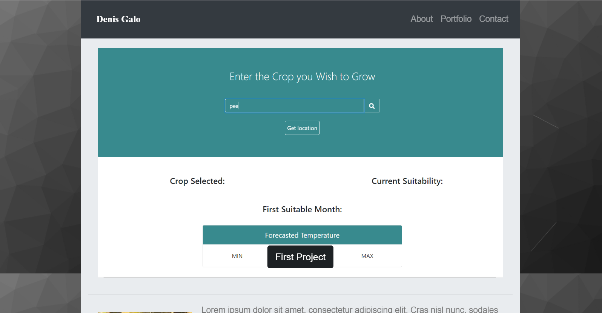
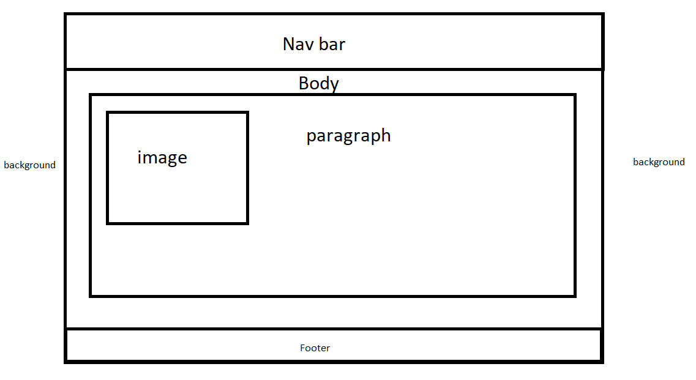

# Bootstrap-Portfolio

## Update 3/16/2019

I have updated the portfolio with a bit more different styling. I've included my first project and I have decided to add some simple animations to the page. I have changed a bit of the layout for the main page I still plan on making more updates to have the page portfolio area and organize the cards with making another area for the three major projects. In the carousel I included a button which takes to the first project page and examples of the site.

## About my portfolio

For this project I attempted to create my own portfolio using bootstrap. Bootstrap help a lot with the basic idea it served more as a backbone to the portfolio that I wanted to make. I did not want to copy exactly what we saw in class but I did want to make it close enough to the template. I used css to help me out with some of the coloring and resizing of a few images and with the margins of a few containers.

## Index 

One of the main and most useful tools in this project was the use of containers and rows I tried my best to keep everything contained and concise as possible. I tried to outline what I wanted the page to be at first and when from there.    

## Portfolio

For the portfolio page I had noticed how the projects were organized in similar ways where you have the column and rows similar to what we had gone over in class. I had the chance to look at some of bootstrap feature and I decided to use cards with pictures. 

## Contact 
The contact page was pretty easy with the help of bootstrap `<form>`. I did still have some trouble with the big box at first but I would still like to play around with more of the css and see what else could be done with the forms.

## CSS
For the Css I did spend a bit more time to try my best to attempt to customize some of the classes that bootstrap has. I did a bit of work to change the nav bar so it does not look to much like the usual bootstrap nav bar 
